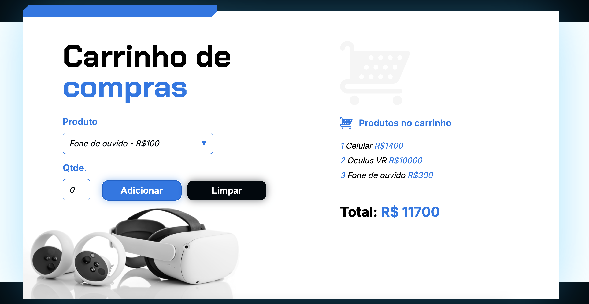

## Screenshots
 

 A shopping cart page.

## Interface
* By clicking on the `Product` box, we can select which product we want to add to the cart.
* By clicking on the `Qty` box, we can choose and inform the quantity we want of each item.
* When we click on `Add`, it will add the item to the list, showing the items we previously added and adding up the total value of them all.
* When we click on `Clear`, it removes all items from the list and resets the total sum value to zero.

## Technologies
* HTML
* CSS
* JavaScript
